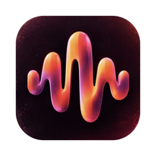
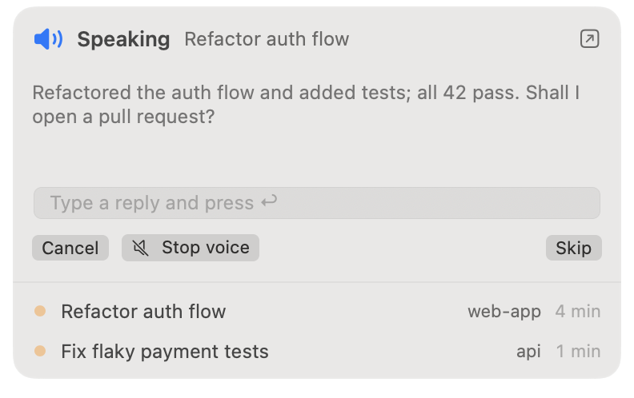
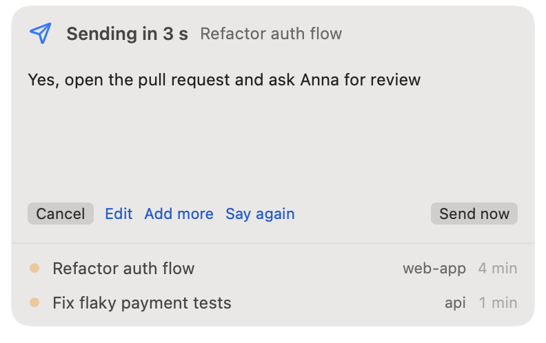
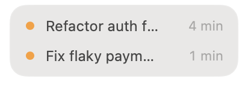

<p align="center"></p>

<h1 align="center">hey2agent</h1>

<p align="center"><b>Talk to Claude Code and Codex.</b> When the agent finishes, it tells you what it did —
you answer by voice, and your reply goes straight into <b>the same session</b>.<br>
Local speech recognition · Russian + English · macOS menu-bar panel</p>

<p align="center"><b>English</b> · <a href="README.ru.md">Русский</a></p>

<p align="center">
  
  
</p>

## What it does
```
Agent finishes ─► "Refactored the auth flow, 42 tests pass. Shall I open a pull request?"
                     ▼  *tink*
You: "Yes, open it and ask Anna for review"     (2 s pause)
                     ▼  3 s to undo
The same session continues with your instruction
```

- **Replies land in the same session.** Uses the agents' own Stop hooks (`decision: block`): no MCP tool
  the agent has to remember to call, no typing into a terminal.
- **Local.** macOS voices for speech, [whisper.cpp](https://github.com/ggml-org/whisper.cpp) for
  recognition. Audio never leaves your Mac.
- **Made for mixed Russian/English dev speech** («закоммить», «пул-реквест», «деплой»).
- **A floating panel that stays out of the way:** a logo square when idle, the tasks in progress with
  their running time, recent chats on hover (click to open the chat, 🎙 to dictate into it).
- **Safety nets:** 3 s to undo or edit what was recognised; **Undo** even after sending (Claude's next
  actions are blocked and it stops); **Stop voice** to read the summary yourself; **Mute** for meetings.
- **10 languages** for the interface (follows the system, or pick one in settings).

<p align="center">
  &nbsp;&nbsp;
  
</p>

## iPhone: walk away from the Mac
Open the iPhone app and the Mac goes quiet: the **phone** shows the tasks in progress, reads the summary
aloud, shows the agent's full answer (**More**), and you reply by voice or text — the session waits up
to 10 minutes. Close the app and everything is back on the Mac.
The phone talks to the Mac directly over your Wi-Fi (Bonjour + TLS keyed by a 6-digit pairing code
from the panel settings) — no server, nothing leaves your network.

Install with Xcode on your own iPhone (a free Apple ID works; free signing expires after 7 days):
```bash
brew install xcodegen
cd iOS && xcodegen generate && open VoiceLoopRemote.xcodeproj   # Signing: pick your team → Run
```

## Voice commands
| Say at the end of a phrase | Effect |
|---|---|
| *(pause 2 s)* or «отправь» / "send" | send |
| «подожди», «надо подумать» / "wait" | keep listening (up to 30 s) |
| «повтори» / "repeat" | replay the summary |
| «отмена» / "cancel" | discard |
| «стоп», «хватит» / silence | let the agent stop |
| «ок», «спасибо» / "ok", "thanks" (the whole phrase) | close the turn, nothing is sent |

Summaries are read by a voice of their language: any Russian in it → the Russian voice, an all-English one → an English voice.

While voice mode is on, the agent is asked to start every answer with a one-line **Summary:**
(«Кратко:» in Russian) — only that line is read aloud.

## Install
Requirements: macOS 15+ on Apple silicon, Python 3, [Homebrew](https://brew.sh).

**As a Claude Code plugin** (recommended) — run inside Claude Code:
```
/plugin marketplace add DmitryVolostnov/hey2agent
/plugin install hey2agent@hey2agent
/hey2agent:setup
```
`/hey2agent:setup` checks your Mac, asks before installing `whisper-cpp`/`ffmpeg`, lets you pick a speech
model, builds the panel and turns voice mode on.

**Manually:**

```bash
brew install whisper-cpp ffmpeg
git clone https://github.com/DmitryVolostnov/hey2agent && cd hey2agent
python3 voice_loop.py install        # Claude Code hooks; asks which speech model to download
python3 voice_loop.py install-codex  # optional: Codex hooks (marked trusted for you), restart Codex
python3 voice_loop.py on
HUD/build.sh && open ~/Applications/VoiceLoopHUD.app
```
The panel asks for microphone access the first time you dictate from it. The app that runs your
agent (Terminal, iTerm, Claude) needs microphone access too.

## Speech models
Pick at install, download more from the panel (settings → Download model), switch any time.

| id | size | notes |
|---|---|---|
| `turbo` | 874 MB | best for mixed Russian/English (default) |
| `turbo-q5` | 574 MB | almost the same quality, 1/3 smaller |
| `small` | 190 MB | faster, mistakes with English terms |
| `base` | 148 MB | fast, weak for Russian |
| `tiny` | 78 MB | fastest, weakest |

## How it works
`voice_loop.py hook` runs on the agent's Stop event: summary → speech → energy-based voice detection on
the mic (`ffmpeg`) → `whisper-cli` → `{"decision":"block","reason":"<your reply>"}`.
`UserPromptSubmit` keeps a list of sessions in progress, `PreToolUse` implements **Undo**.
The panel (SwiftUI) and the script talk through small files in `~/.voice-loop/`, so the script also
works without the panel. Chats open via the Claude app's own `claude://code/continue` link.

```bash
python3 -m unittest discover tests                       # logic
VOICE_LOOP_SLOW=1 python3 -m unittest tests.test_speech  # say → whisper round trip
```
Translations: edit `Localization/translations.json`, run `python3 Localization/generate.py`.

## Similar projects
[Heard](https://github.com/heardlabs/heard) (closest; multi-agent voices, paid cloud tiers),
[VoiceMode](https://github.com/mbailey/voicemode) (MCP `converse` tool),
[spanderok/jarvis](https://github.com/spanderok/jarvis) (wake word, Russian), and many
speak-only Stop-hook scripts. hey2agent focuses on replying into the same session via hooks, a
multi-session panel for Claude Code and Codex, and local Russian/English.

## Status
Early, built for daily personal use. Known limits: while listening the hook holds the session
(≤ 3 min); Codex: no **Undo** after sending yet.

## License
MIT
